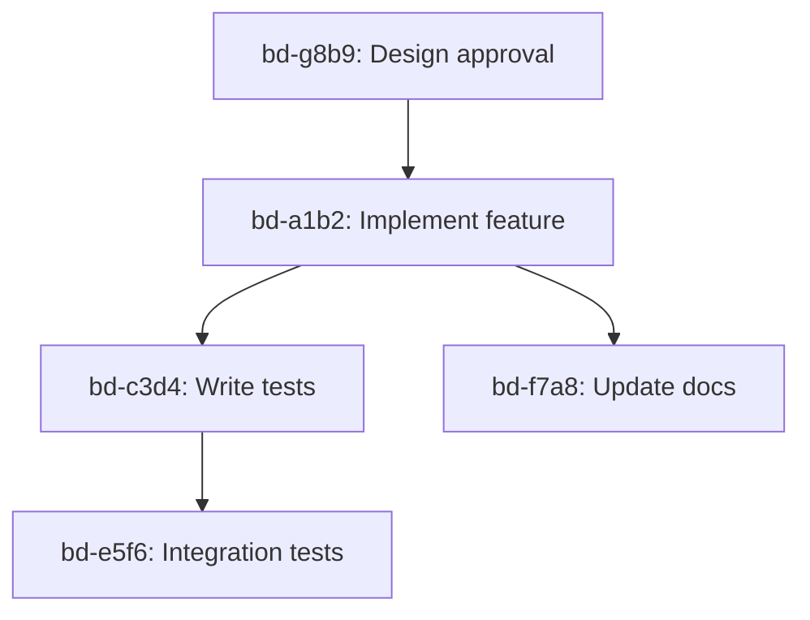

# Shortlist (User-Directed Priority)

This file represents **explicit user intent**. Agent may only modify when explicitly instructed.

---

## DB-Issues Migration (MIGRATE-050 through MIGRATE-085)

Continued migration of the issue-tracker project to `dot-work db-issues`.
Note: MIGRATE-041 (enums), MIGRATE-042 (epic CLI), MIGRATE-043 (JSONL), MIGRATE-044 (multi-format output), MIGRATE-045 (search), MIGRATE-046 (transition validation), MIGRATE-047 (circular dependency detection), MIGRATE-048 (label management), MIGRATE-049 (enhanced update with $EDITOR), MIGRATE-050 (documentation), MIGRATE-051 (comments), MIGRATE-052 (instruction templates), MIGRATE-053 (JSON templates), MIGRATE-054 (bulk operations) completed 2024-12-23.


---

---

## MIGRATE-054@f8a9b0

---
id: "MIGRATE-054@f8a9b0"
title: "Implement Bulk Operations (create, close, update)"
description: "Add bulk-create, bulk-close, bulk-update commands for managing multiple issues at once"
created: 2024-12-22
completed: 2024-12-23
section: "db_issues"
tags: [migration, db-issues, bulk-operations, cli]
type: enhancement
priority: high
status: completed
references:
  - src/dot_work/db_issues/cli.py
---

### Problem
Users need to create, close, or update multiple issues in a single operation for efficiency.

### CLI Commands
```bash
# Bulk create from CSV/JSON
dot-work db-issues bulk-create --file issues.csv
dot-work db-issues bulk-create --file issues.json

# Bulk create from stdin
cat issues.json | dot-work db-issues bulk-create

# Bulk close by filter
dot-work db-issues bulk-close --status "in-progress"
dot-work db-issues bulk-close --priority low
dot-work db-issues bulk-close --label "wontfix"

# Bulk update
dot-work db-issues bulk-update --status "in-progress" --set priority=high
dot-work db-issues bulk-update --label "bug" --set status=blocked
```

### Input Formats

**CSV format:**
```csv
title,priority,type,description
"Fix parser bug",high,bug,"Parser fails on nested quotes"
"Add feature",medium,feature,"User authentication"
```

**JSON format:**
```json
[
  {"title": "Fix parser", "priority": "high", "type": "bug"},
  {"title": "Add feature", "priority": "medium", "type": "feature"}
]
```

### Proposed Solution
1. Create BulkService for batch operations
2. Add CSV/JSON parsing utilities
3. Implement bulk-create with file input
4. Implement bulk-close with filtering
5. Implement bulk-update with field changes
6. Show progress for large operations

### Acceptance Criteria
- [ ] Can bulk create from CSV file
- [ ] Can bulk create from JSON file
- [ ] Can bulk close with filters
- [ ] Can bulk update with --set option
- [ ] Shows progress for operations
- [ ] Reports success/failure count
- [ ] Handles errors gracefully (continues on partial failure)

### Notes
Depends on MIGRATE-036 (CLI must exist).

---

## MIGRATE-055@a9b0c1

---
id: "MIGRATE-055@a9b0c1"
title: "Implement Bulk Label Operations"
description: "Add bulk-label-add and bulk-label-remove commands for managing labels across multiple issues"
created: 2024-12-22
started: 2024-12-23
section: "db_issues"
tags: [migration, db-issues, labels, bulk-operations]
type: enhancement
priority: medium
status: in-progress
references:
  - src/dot_work/db_issues/cli.py
---

### Problem
Adding or removing labels from multiple issues individually is tedious. Bulk operations are needed.

### CLI Commands
```bash
# Bulk add labels
dot-work db-issues bulk-label-add "urgent" --status open
dot-work db-issues bulk-label-add "needs-review" --priority high,medium
dot-work db-issues bulk-label-add "backlog" --type task

# Bulk remove labels
dot-work db-issues bulk-label-remove "wontfix" --all
dot-work db-issues bulk-label-remove "old-label" --status completed

# Multiple labels at once
dot-work db-issues bulk-label-add "review","test" --priority critical
```

### Filter Options
- `--status <status>` - Filter by status
- `--priority <prio>` - Filter by priority (comma-separated)
- `--type <type>` - Filter by type
- `--label <label>` - Filter by existing label
- `--all` - Apply to all issues

### Proposed Solution
1. Extend label commands with bulk operations
2. Add filtering support to LabelService
3. Implement bulk-label-add command
4. Implement bulk-label-remove command
5. Support multiple labels in single command

### Acceptance Criteria
- [ ] Can add label to multiple issues by filter
- [ ] Can remove label from multiple issues by filter
- [ ] Can handle multiple labels in one command
- [ ] Shows count of affected issues
- [ ] Supports all filter options
- [ ] `--all` applies to all issues

### Notes
Depends on MIGRATE-036 (CLI must exist).

---

## MIGRATE-056@b0c1d2

---
id: "MIGRATE-056@b0c1d2"
title: "Implement Advanced Dependency Features (list-all, tree, cycles)"
description: "Add global dependency listing, dependency tree visualization, and cycle detection with fix suggestions"
created: 2024-12-22
section: "db_issues"
tags: [migration, db-issues, dependencies, visualization]
type: enhancement
priority: medium
status: proposed
references:
  - src/dot_work/db_issues/services/dependency_service.py
---

### Problem
Users need to see all dependencies globally, visualize dependency trees, and detect circular dependencies.

### CLI Commands
```bash
# List all dependencies globally
dot-work db-issues dependencies list-all
dot-work db-issues dependencies list-all --type blocks
dot-work db-issues dependencies list-all --format json

# Dependency tree visualization
dot-work db-issues dependencies tree <id>
dot-work db-issues dependencies tree <id> --format ascii
dot-work db-issues dependencies tree <id> --format mermaid

# Cycle detection
dot-work db-issues dependencies cycles
dot-work db-issues dependencies cycles --fix  # suggest fixes
```

### Dependency Types (from source)
- `blocks` - A blocks B (B cannot complete until A completes)
- `depends-on` - A depends on B (A cannot start until B completes)
- `related-to` - A and B are related
- `discovered-from` - A was discovered from B

### Tree Output
```
$ dot-work db-issues dependencies tree bd-a1b2

bd-a1b2 (Implement feature)
├── bd-c3d4 (Write tests) [blocks]
├── bd-e5f6 (Update docs) [blocks]
│   └── bd-f7a8 (Review docs) [blocks]
└── bd-g8b9 (Add examples) [depends-on]
```

### Cycle Detection Output
```
$ dot-work db-issues dependencies cycles

Circular dependencies detected:
1. bd-a1b2 <-> bd-c3d4
   bd-a1b2 blocks bd-c3d4
   bd-c3d4 blocks bd-a1b2
   
   Suggested fix: Remove bd-c3d4 -> bd-a1b2 dependency
```

### Proposed Solution
1. Implement global dependency listing (list-all)
2. Implement ASCII tree rendering
3. Implement Mermaid diagram generation
4. Implement cycle detection using DFS
5. Add fix suggestion logic

### Acceptance Criteria
- [ ] `list-all` shows all dependencies in the system
- [ ] `tree` shows ASCII dependency hierarchy
- [ ] `tree --format mermaid` generates Mermaid diagram
- [ ] `cycles` detects all circular dependencies
- [ ] `cycles --fix` provides removal suggestions
- [ ] Supports JSON output format

### Notes
Depends on MIGRATE-047 (basic dependency detection).

---

## MIGRATE-057@c1d2e3

---
id: "MIGRATE-057@c1d2e3"
title: "Implement Ready Queue Calculation"
description: "Add ready command to show issues with no open blockers"
created: 2024-12-22
section: "db_issues"
tags: [migration, db-issues, dependencies, workflow]
type: enhancement
priority: medium
status: proposed
references:
  - src/dot_work/db_issues/cli.py
---

### Problem
Users need to quickly identify which issues are ready to work on (no blocking dependencies).

### CLI Command
```bash
dot-work db-issues ready
dot-work db-issues ready --sort priority
dot-work db-issues ready --priority high,medium
dot-work db-issues ready --format json
```

### Ready Queue Logic
An issue is "ready" if:
1. Status is "open" or "in-progress"
2. No open "blocks" dependencies pointing to it
3. No "blocked" status

### Example Output
```
$ dot-work db-issues ready

Ready to work on (5 issues):
ID        Title                          Priority  Status
bd-a1b2   Fix parser bug                 high      open
bd-c3d4   Add user authentication        medium    in-progress
bd-e5f6   Update documentation            low       open
bd-f7a8   Write tests                    medium    open
bd-g8b9   Code review                    high      open

Blocked issues (3):
bd-h9c0   Deploy to production           -         blocked (blocked by bd-a1b2)
bd-i0d1   Integration testing            -         blocked (blocked by bd-c3d4)
```

### Proposed Solution
1. Add `ready` command to CLI
2. Implement ready queue calculation logic
3. Filter issues with no open blockers
4. Show blocked issues separately
5. Support sorting and filtering options

### Acceptance Criteria
- [ ] `ready` shows issues with no blockers
- [ ] Shows blocked issues separately with reasons
- [ ] `--sort priority` sorts by priority
- [ ] `--priority` filter works
- [ ] `--format json` outputs structured data

### Notes
Depends on MIGRATE-056 (dependency tree must exist).

---

## MIGRATE-058@d2e3f4

---
id: "MIGRATE-058@d2e3f4"
title: "Implement Advanced Epic Features (set, clear, all, tree)"
description: "Add set, clear, all, and tree commands for complete epic management"
created: 2024-12-22
section: "db_issues"
tags: [migration, db-issues, epics, cli]
type: enhancement
priority: medium
status: proposed
references:
  - src/dot_work/db_issues/cli.py
---

### Problem
Current epic commands are incomplete. Need set, clear, all listing, and tree visualization.

### CLI Commands
```bash
# Epic management
dot-work db-issues epics set <id> <epic_id>      # Assign to epic
dot-work db-issues epics clear <id>               # Remove from epic
dot-work db-issues epics all                      # List all epics with counts
dot-work db-issues epics tree <epic_id>           # Show epic hierarchy
dot-work db-issues epics tree --all               # Show all epic trees
```

### Commands Detail

**epics set**: Assign issue to epic (overwrites any existing epic assignment)
```bash
dot-work db-issues epics set bd-a1b2 bd-epic1
```

**epics clear**: Remove epic assignment
```bash
dot-work db-issues epics clear bd-a1b2
```

**epics all**: List all epics with issue counts
```bash
$ dot-work db-issues epics all

EPIC-001    User Authentication      5 issues (2 open, 1 in-progress, 2 completed)
EPIC-002    Payment Processing      8 issues (4 open, 2 in-progress, 2 completed)
EPIC-003    Dashboard Redesign       3 issues (1 open, 2 completed)
```

**epics tree**: Show hierarchical epic structure
```bash
$ dot-work db-issues epics tree EPIC-001

EPIC-001: User Authentication
├── bd-a1b2 (Implement login) - open
├── bd-c3d4 (Add OAuth) - in-progress
│   ├── bd-e5f6 (OAuth provider setup) - completed
│   └── bd-f7a8 (Token handling) - open
└── bd-g8b9 (Password reset) - open
```

### Proposed Solution
1. Add set, clear, all, tree commands to epics_app
2. Implement epic counting logic
3. Implement hierarchical tree rendering
4. Support ASCII tree output
5. Track epic assignments in database

### Acceptance Criteria
- [ ] `epics set` assigns issue to epic
- [ ] `epics clear` removes epic assignment
- [ ] `epics all` lists all epics with counts
- [ ] `epics tree` shows epic hierarchy
- [ ] `epics tree --all` shows all epics
- [ ] Tree output is properly indented

### Notes
Depends on MIGRATE-042 (basic epic commands).

---

## MIGRATE-059@e3f4a5

---
id: "MIGRATE-059@e3f4a5"
title: "Implement Advanced Label Features (set, all, bulk)"
description: "Add set to replace labels, all to list unique globally, and bulk operations"
created: 2024-12-22
section: "db_issues"
tags: [migration, db-issues, labels, cli]
type: enhancement
priority: medium
status: proposed
references:
  - src/dot_work/db_issues/cli.py
---

### Problem
Label management is incomplete. Need set to replace all labels, all to list globally, and bulk operations.

### CLI Commands
```bash
# Advanced label operations
dot-work db-issues labels set <id> "bug","urgent","high-priority"  # Replace all labels
dot-work db-issues labels all                                       # List all unique labels
dot-work db-issues labels all --with-counts                         # Show usage counts
dot-work db-issues labels all --unused                              # Show unused labels

# Bulk operations (also in MIGRATE-055)
dot-work db-issues labels bulk-add "review" --status in-progress
dot-work db-issues labels bulk-remove "wontfix" --all
```

### Commands Detail

**labels set**: Replace all labels on an issue
```bash
$ dot-work db-issues labels set bd-a1b2 bug,critical,security
# Replaces existing labels with: bug, critical, security
```

**labels all**: List all unique labels globally
```bash
$ dot-work db-issues labels all

All labels (12 unique):
  bug           (15 issues)
  feature       (8 issues)
  urgent        (3 issues)
  security      (2 issues)
  documentation (5 issues)
  testing       (10 issues)
  ...

$ dot-work db-issues labels all --unused

Unused labels:
  old-label     (0 issues)
  deprecated    (0 issues)
```

### Proposed Solution
1. Add `set` command to replace all labels
2. Add `all` command to list globally unique labels
3. Implement label counting and unused detection
4. Integrate with bulk operations from MIGRATE-055

### Acceptance Criteria
- [ ] `labels set` replaces all labels on issue
- [ ] `labels all` lists all unique labels
- [ ] `labels all --with-counts` shows usage
- [ ] `labels all --unused` shows unused labels
- [ ] Bulk operations integrated

### Notes
Depends on MIGRATE-048 (basic label management).

---

## MIGRATE-060@f4a5b6

---
id: "MIGRATE-060@f4a5b6"
title: "Implement Issue Status Commands (ready, blocked, stale)"
description: "Add ready, blocked, and stale commands for advanced status management"
created: 2024-12-22
section: "db_issues"
tags: [migration, db-issues, status, cli]
type: enhancement
priority: medium
status: proposed
references:
  - src/dot_work/db_issues/cli.py
---

### Problem
Users need quick commands to mark issues as ready, blocked, or stale.

### CLI Commands
```bash
# Status shortcuts
dot-work db-issues ready <id>           # Mark as ready to work on
dot-work db-issues blocked <id>         # Mark as blocked
dot-work db-issues blocked <id> --reason "Waiting for design"
dot-work db-issues stale <id>           # Mark as stale
dot-work db-issues stale --auto         # Auto-detect stale issues

# Additional status values
dot-work db-issues resolve <id>         # Mark as resolved
dot-work db-issues start <id>           # Mark as in-progress
```

### Status Values (Extended)
- `open` - Default status for new issues
- `in-progress` - Actively being worked on
- `blocked` - Blocked by dependency or external factor
- `resolved` - Fixed but not verified
- `completed` - Verified and closed
- `stale` - No activity for extended period

### Commands Detail

**ready**: Mark issue as ready (sets status to open if blocked)
```bash
dot-work db-issues ready bd-a1b2
# Marks as ready, unblocks if blocked
```

**blocked**: Mark as blocked with optional reason
```bash
dot-work db-issues blocked bd-a1b2 --reason "Waiting for API design"
```

**stale**: Mark as stale or auto-detect
```bash
dot-work db-issues stale bd-a1b2                    # Mark specific issue
dot-work db-issues stale --auto                      # Auto-mark stale issues
dot-work db-issues stale --auto --days 30            # Stale threshold (default: 90)
```

### Proposed Solution
1. Add ready, blocked, stale commands
2. Add resolve, start shortcuts
3. Implement stale detection (no activity for X days)
4. Support blocked reasons
5. Extend Status enum with resolved, stale

### Acceptance Criteria
- [ ] `ready` marks issue as ready
- [ ] `blocked` marks issue with reason
- [ ] `stale` marks specific issue
- [ ] `stale --auto` detects stale issues
- [ ] `stale --days` sets threshold
- [ ] `resolve` and `start` commands work

### Notes
Depends on MIGRATE-041 (Status enum), MIGRATE-046 (status transitions).

---

## MIGRATE-061@a5b6c7

---
id: "MIGRATE-061@a5b6c7"
title: "Implement System Commands (init, info, compact)"
description: "Add init, info, and compact commands for system management"
created: 2024-12-22
section: "db_issues"
tags: [migration, db-issues, system, cli]
type: enhancement
priority: medium
status: proposed
references:
  - src/dot_work/db_issues/cli.py
---

### Problem
Users need system-level commands to initialize the tracker, show system info, and compact the database.

### CLI Commands
```bash
# System commands
dot-work db-issues init                          # Initialize database
dot-work db-issues init --force                   # Reinitialize (overwrite)
dot-work db-issues info                           # Show system information
dot-work db-issues compact                        # Compact database
dot-work db-issues compact --vacuum               # Run VACUUM
```

### Commands Detail

**init**: Initialize the issue tracker database
```bash
$ dot-work db-issues init

Initializing issue tracker at .work/db-issues/
Creating database schema...
Database initialized successfully.

Issue count: 0
Epic count: 0
Database: .work/db-issues/issues.db
```

**info**: Show system information
```bash
$ dot-work db-issues info

Issue Tracker Information:
Database: .work/db-issues/issues.db
Size: 2.4 MB

Issues:
  Total: 47
  Open: 12
  In-progress: 8
  Blocked: 3
  Completed: 21
  Resolved: 3

Epics: 5
Labels: 18 unique
Dependencies: 34

Last activity: 2024-12-22 10:30:00
```

**compact**: Compact database to reduce size
```bash
$ dot-work db-issues compact

Compacting database...
Before: 5.2 MB
After: 3.8 MB
Saved: 1.4 MB (27% reduction)
```

### Proposed Solution
1. Implement init with schema creation
2. Implement info with database statistics
3. Implement compact with VACUUM
4. Add --force option to init
5. Support --vacuum option for deep compaction

### Acceptance Criteria
- [ ] `init` creates database at .work/db-issues/
- [ ] `init --force` reinitializes database
- [ ] `info` shows database statistics
- [ ] `compact` reduces database size
- [ ] `compact --vacuum` runs SQLite VACUUM

### Notes
Depends on MIGRATE-038 (storage configuration).

---

## MIGRATE-062@b6c7d8

---
id: "MIGRATE-062@b6c7d8"
title: "Implement Sync Command with Git Integration"
description: "Add sync command to export to JSONL and commit to git"
created: 2024-12-22
section: "db_issues"
tags: [migration, db-issues, git, sync, jsonl]
type: enhancement
priority: medium
status: proposed
references:
  - src/dot_work/db_issues/cli.py
---

### Problem
Users need to backup issues to git-tracked JSONL for version control and collaboration.

### CLI Command
```bash
dot-work db-issues sync                          # Export and commit
dot-work db-issues sync --message "Update issues" # Custom commit message
dot-work db-issues sync --push                   # Also push to remote
dot-work db-issues sync --dry-run                # Show what would be done
```

### Sync Process
1. Export all issues to JSONL format
2. Write to `.work/db-issues/issues.jsonl`
3. Git add the JSONL file
4. Git commit with auto-generated or custom message
5. Optionally push to remote

### JSONL Format
```jsonl
{"id":"bd-a1b2","title":"Fix parser","status":"open","priority":"high","type":"bug","created_at":"2024-12-22T10:00:00Z","updated_at":"2024-12-22T10:00:00Z"}
{"id":"bd-c3d4","title":"Add feature","status":"in-progress","priority":"medium","type":"feature","created_at":"2024-12-22T11:00:00Z","updated_at":"2024-12-22T11:30:00Z"}
```

### Proposed Solution
1. Implement JsonlExporter
2. Add sync command with git integration
3. Support custom commit messages
4. Add --push option
5. Add --dry-run for preview

### Acceptance Criteria
- [ ] `sync` exports to JSONL
- [ ] `sync` commits to git
- [ ] `sync --message` uses custom message
- [ ] `sync --push` pushes to remote
- [ ] `sync --dry-run` shows preview
- [ ] JSONL file is git-tracked

### Notes
Depends on MIGRATE-043 (JSONL export), MIGRATE-037 (gitpython).

---

## MIGRATE-063@c7d8e9

---
id: "MIGRATE-063@c7d8e9"
title: "Implement Rename-Prefix Command"
description: "Add rename-prefix command to change issue ID prefixes"
created: 2024-12-22
section: "db_issues"
tags: [migration, db-issues, cli, maintenance]
type: enhancement
priority: low
status: proposed
references:
  - src/dot_work/db_issues/cli.py
---

### Problem
Users need to rename issue ID prefixes (e.g., change "FEAT" to "FEATURE") for consistency.

### CLI Command
```bash
dot-work db-issues rename-prefix <old> <new>
dot-work db-issues rename-prefix FEAT FEATURE
dot-work db-issues rename-prefix BUG DEFECT --dry-run
```

### Example
```bash
$ dot-work db-issues rename-prefix FEAT FEATURE

This will rename 15 issues with prefix "FEAT" to "FEATURE":
  FEAT-001 -> FEATURE-001
  FEAT-002 -> FEATURE-002
  ...
  
Proceed? [y/N]: y

Renamed 15 issues successfully.
```

### Proposed Solution
1. Add rename-prefix command
2. Find all issues with old prefix
3. Update to new prefix in database
4. Support --dry-run for preview
5. Show confirmation prompt

### Acceptance Criteria
- [ ] Can rename issue prefixes
- [ ] Shows count of affected issues
- [ ] --dry-run previews changes
- [ ] Prompts for confirmation
- [ ] Updates all matching issues

### Notes
Depends on MIGRATE-034 (entities must exist).

---

## MIGRATE-064@d8e9f0

---
id: "MIGRATE-064@d8e9f0"
title: "Implement Cleanup Command"
description: "Add cleanup command to archive or delete old completed issues"
created: 2024-12-22
section: "db_issues"
tags: [migration, db-issues, maintenance, cli]
type: enhancement
priority: low
status: proposed
references:
  - src/dot_work/db_issues/cli.py
---

### Problem
Users need to clean up old completed issues to keep the database manageable.

### CLI Commands
```bash
# Cleanup operations
dot-work db-issues cleanup --status completed --days 90
dot-work db-issues cleanup --archive              # Archive instead of delete
dot-work db-issues cleanup --dry-run              # Preview cleanup
```

### Options
- `--status <status>` - Filter by status (default: completed)
- `--days <N>` - Issues older than N days
- `--archive` - Archive to separate file instead of deleting
- `--dry-run` - Preview without changes
- `--force` - Skip confirmation

### Archive Format
```
.work/db-issues/archive/
└── 2024-12/
    └── issues-2024-12-22.jsonl
```

### Example
```bash
$ dot-work db-issues cleanup --status completed --days 90 --archive

Found 23 completed issues older than 90 days.
Archiving to .work/db-issues/archive/2024-12/issues-2024-12-22.jsonl

Archived 23 issues successfully.
```

### Proposed Solution
1. Implement cleanup command
2. Add age filtering logic
3. Support archive mode
4. Add --dry-run preview
5. Add confirmation prompt

### Acceptance Criteria
- [ ] Can cleanup old completed issues
- [ ] `--days` filters by age
- [ ] `--archive` archives instead of deleting
- [ ] `--dry-run` shows preview
- [ ] Prompts for confirmation

### Notes
Depends on MIGRATE-043 (JSONL export for archive).

---

## MIGRATE-065@e9f0a1

---
id: "MIGRATE-065@e9f0a1"
title: "Implement Duplicates Detection"
description: "Add duplicates command to find potential duplicate issues"
created: 2024-12-22
section: "db_issues"
tags: [migration, db-issues, duplicates, analysis]
type: enhancement
priority: low
status: proposed
references:
  - src/dot_work/db_issues/services/duplicate_service.py
---

### Problem
Users need to find and manage duplicate issues to keep the tracker clean.

### CLI Commands
```bash
# Find duplicates
dot-work db-issues duplicates                         # Find potential duplicates
dot-work db-issues duplicates --threshold 0.8         # Similarity threshold
dot-work db-issues duplicates --format json           # JSON output

# Merge duplicates
dot-work db-issues duplicates merge <source> <target> # Merge source into target
dot-work db-issues duplicates merge <source> <target> --keep-comments
```

### Detection Algorithm
Use title similarity and common tags to find potential duplicates:
1. Normalize titles (lowercase, remove punctuation)
2. Calculate Jaccard similarity
3. Group issues with similarity > threshold
4. Report groups as potential duplicates

### Example Output
```
$ dot-work db-issues duplicates

Potential duplicates found (3 groups):
1. Similarity: 0.92
   - bd-a1b2: Fix parser bug
   - bd-c3d4: Fix parsing issue
   
2. Similarity: 0.87
   - bd-e5f6: Add authentication
   - bd-f7a8: Implement login
   
3. Similarity: 0.85
   - bd-g8b9: Update docs
   - bd-h9c0: Documentation update
```

### Proposed Solution
1. Create DuplicateService
2. Implement similarity detection
3. Add duplicates list command
4. Add merge command (MIGRATE-066)
5. Support JSON output

### Acceptance Criteria
- [ ] Finds potential duplicate issues
- [ ] Uses title similarity
- [ ] `--threshold` adjusts sensitivity
- [ ] Groups duplicates by similarity
- [ ] `--format json` outputs structured data

### Notes
Depends on MIGRATE-045 (search service).

---

## MIGRATE-066@f0a1b2

---
id: "MIGRATE-066@f0a1b2"
title: "Implement Merge Command"
description: "Add merge command to combine duplicate issues"
created: 2024-12-22
section: "db_issues"
tags: [migration, db-issues, duplicates, cli]
type: enhancement
priority: low
status: proposed
references:
  - src/dot_work/db_issues/cli.py
---

### Problem
When duplicate issues are found, users need to merge them into a single issue.

### CLI Command
```bash
dot-work db-issues merge <source_id> <target_id>
dot-work db-issues merge <source_id> <target_id> --keep-comments
dot-work db-issues merge <source_id> <target_id> --keep-labels
dot-work db-issues merge <source_id> <target_id> --close-source
```

### Merge Behavior
- Copy title from source (or use target title)
- Combine descriptions
- Merge dependencies
- Merge labels
- Copy comments (if --keep-comments)
- Close source issue (if --close-source)
- Delete source issue (default)

### Example
```bash
$ dot-work db-issues merge bd-c3d4 bd-a1b2 --keep-comments --close-source

Merging bd-c3d4 into bd-a1b2:
- Labels merged: [bug, parser] + [urgent] = [bug, parser, urgent]
- Comments copied: 2 comments from bd-c3d4
- Dependencies merged: 1 dependency added
- Source issue bd-c3d4 closed

Merge complete.
```

### Proposed Solution
1. Implement merge command
2. Combine descriptions intelligently
3. Merge dependencies, labels
4. Support --keep-comments option
5. Support --close-source option

### Acceptance Criteria
- [ ] Merges source into target
- [ ] Combines descriptions
- [ ] Merges dependencies
- [ ] Merges labels
- [ ] `--keep-comments` copies comments
- [ ] `--close-source` closes instead of deleting

### Notes
Depends on MIGRATE-065 (duplicates detection).

---

## MIGRATE-067@a1b2c3

---
id: "MIGRATE-067@a1b2c3"
title: "Implement Edit Command ($EDITOR integration)"
description: "Add edit command to open issues in external editor"
created: 2024-12-22
section: "db_issues"
tags: [migration, db-issues, editor, cli]
type: enhancement
priority: medium
status: proposed
references:
  - src/dot_work/db_issues/cli.py
---

### Problem
Users need to edit issues in their preferred external editor for complex changes.

### CLI Commands
```bash
dot-work db-issues edit <id>                     # Use $EDITOR
dot-work db-issues edit <id> --editor vim        # Use specific editor
dot-work db-issues edit <id> --editor code       # Use VS Code
```

### Editor File Format
```yaml
# dot-work db-issues edit
# Lines starting with # are comments
# Save and exit to apply changes, or exit without saving to cancel

id: bd-a1b2
title: Fix parser bug
description: |
  The parser fails when input contains
  nested quotes. Need to handle this case.
  
  Example:
  ```
  "foo \"bar\" baz"
  ```
priority: high
type: bug
status: in-progress
labels:
  - parser
  - bug
  - urgent
assignee: john

# Dependencies (leave empty if none)
dependencies:
  blocks: []
  depends-on: [bd-c3d4]
```

### Behavior
1. Create temp file with current issue state
2. Open in $EDITOR (or specified editor)
3. Wait for editor to exit
4. Parse modified file
5. Apply changes if file modified
6. Cancel if file unchanged

### Proposed Solution
1. Implement edit command
2. Create YAML temp file format
3. Parse YAML on exit
4. Detect changes (mtime or hash)
5. Apply validated changes

### Acceptance Criteria
- [ ] Opens issue in $EDITOR
- [ ] `--editor` uses specific editor
- [ ] YAML format is intuitive
- [ ] Changes applied on save
- [ ] Cancelled if no changes
- [ ] Validation errors reported

### Notes
Depends on MIGRATE-049 (enhanced update).

---

## MIGRATE-068@b2c3d4

---
id: "MIGRATE-068@b2c3d4"
title: "Implement Restore Command"
description: "Add restore command to restore deleted issues"
created: 2024-12-22
section: "db_issues"
tags: [migration, db-issues, cli, soft-delete]
type: enhancement
priority: low
status: proposed
references:
  - src/dot_work/db_issues/cli.py
---

### Problem
Users need to restore accidentally deleted issues (soft delete pattern).

### CLI Commands
```bash
dot-work db-issues restore <id>                    # Restore deleted issue
dot-work db-issues restore --list                  # List deleted issues
dot-work db-issues restore --all                   # Restore all deleted
```

### Soft Delete Implementation
- Issues marked as deleted (not removed from DB)
- Add `deleted_at` timestamp column
- Filter out deleted issues from normal queries
- Restore clears `deleted_at` timestamp

### Example
```bash
$ dot-work db-issues restore --list

Deleted issues (3):
  bd-a1b2 - Fix parser bug (deleted 2024-12-20)
  bd-c3d4 - Add feature (deleted 2024-12-21)
  bd-e5f6 - Update docs (deleted 2024-12-22)

$ dot-work db-issues restore bd-a1b2

Restored bd-a1b2: Fix parser bug
```

### Proposed Solution
1. Add `deleted_at` column to issues table
2. Filter deleted issues from normal queries
3. Implement restore command
4. Add `--list` to show deleted issues
5. Add `--all` to restore all

### Acceptance Criteria
- [ ] Deleted issues soft-deleted (marked, not removed)
- [ ] `restore <id>` restores specific issue
- [ ] `restore --list` shows deleted issues
- [ ] `restore --all` restores all deleted
- [ ] Normal queries don't show deleted issues

### Notes
Depends on MIGRATE-034 (entities must exist).

---

## MIGRATE-069@c3d4e5

---
id: "MIGRATE-069@c3d4e5"
title: "Implement Delete with --force Flag"
description: "Add --force flag to delete command to skip confirmation"
created: 2024-12-22
section: "db_issues"
tags: [migration, db-issues, cli, safety]
type: enhancement
priority: low
status: proposed
references:
  - src/dot_work/db_issues/cli.py
---

### Problem
Automated scripts need to delete issues without interactive confirmation.

### CLI Commands
```bash
dot-work db-issues delete <id>                    # Prompts for confirmation
dot-work db-issues delete <id> --force             # Skips confirmation
dot-work db-issues delete <id> <id2> <id3> --force # Delete multiple
```

### Behavior
- Without `--force`: Prompt for confirmation
- With `--force`: Delete immediately
- Multiple IDs: Delete all without individual prompts

### Example
```bash
$ dot-work db-issues delete bd-a1b2

Delete issue bd-a1b2: Fix parser bug? [y/N]: y

Issue bd-a1b2 deleted.

$ dot-work db-issues delete bd-c3d4 bd-e5f6 --force

Deleted 2 issues.
```

### Proposed Solution
1. Add `--force` flag to delete command
2. Support multiple issue IDs
3. Require confirmation unless --force
4. Show count when deleting multiple

### Acceptance Criteria
- [ ] Delete prompts for confirmation by default
- [ ] `--force` skips confirmation
- [ ] Supports multiple issue IDs
- [ ] Shows count of deleted issues
- [ ] Works with comments delete too

### Notes
Depends on MIGRATE-036 (CLI must exist).

---

## MIGRATE-070@d4e5f6

---
id: "MIGRATE-070@d4e5f6"
title: "Implement FTS5 Full-Text Search"
description: "Add SQLite FTS5 full-text search with BM25 ranking and snippet highlighting"
created: 2024-12-22
section: "db_issues"
tags: [migration, db-issues, search, fts5]
type: enhancement
priority: medium
status: proposed
references:
  - src/dot_work/db_issues/services/search_service.py
---

### Problem
Basic LIKE search is slow and doesn't rank results. Need FTS5 with ranking.

### CLI Commands
```bash
# Full-text search
dot-work db-issues search "parser bug"
dot-work db-issues search "parser" --in title
dot-work db-issues search "parser OR bug"
dot-work db-issues search "parser NEAR bug"
```

### FTS5 Features
- BM25 ranking algorithm
- Snippet highlighting with `<mark>` tags
- Boolean operators (AND, OR, NOT)
- Phrase search
- Proximity search (NEAR)
- Field-specific search

### Search Query Syntax
```
title:parser                    # Search in title only
description:bug                 # Search in description only
parser AND bug                  # Both terms
parser OR bug                   # Either term
parser NOT bug                  # Exclude term
"parser bug"                    # Phrase search
parser NEAR/5 bug              # Within 5 words
```

### Example Output
```
$ dot-work db-issues search "parser bug"

1. bd-a1b2 (Score: 3.2)
   Fix parser bug
   The parser fails when input contains nested quotes.
   
   Matches: <mark>parser</mark> <mark>bug</mark>

2. bd-c3d4 (Score: 2.1)
   Parser improvement
   Fix a bug in the parser module.
   
   Matches: <mark>Parser</mark>, <mark>bug</mark>
```

### Proposed Solution
1. Create FTS5 virtual table
2. Populate with triggers on main table
3. Implement BM25 ranking
4. Add snippet highlighting
5. Support boolean and proximity queries

### Acceptance Criteria
- [ ] FTS5 virtual table created
- [ ] Search uses FTS5 with ranking
- [ ] Results sorted by relevance
- [ ] Snippet highlighting works
- [ ] Boolean operators work
- [ ] Field-specific search works

### Notes
Depends on MIGRATE-045 (enhanced search).

---

## MIGRATE-071@e5f6a7

---
id: "MIGRATE-071@e5f6a7"
title: "Implement Statistics and Analytics"
description: "Add stats command with comprehensive metrics and trend analysis"
created: 2024-12-22
section: "db_issues"
tags: [migration, db-issues, statistics, analytics]
type: enhancement
priority: low
status: proposed
references:
  - src/dot_work/db_issues/services/stats_service.py
---

### Problem
Users need insights into issue metrics and trends.

### CLI Commands
```bash
dot-work db-issues stats                           # Overall statistics
dot-work db-issues stats --by status               # Group by status
dot-work db-issues stats --by priority             # Group by priority
dot-work db-issues stats --by type                 # Group by type
dot-work db-issues stats --trend                   # Show trends over time
dot-work db-issues stats --format json             # JSON output
```

### Statistics Display
```
$ dot-work db-issues stats

Issue Statistics:
Total Issues: 47

By Status:
  open:          12 (25.5%)
  in-progress:    8 (17.0%)
  blocked:        3 (6.4%)
  completed:     21 (44.7%)
  resolved:       3 (6.4%)

By Priority:
  critical:       5 (10.6%)
  high:          12 (25.5%)
  medium:        20 (42.6%)
  low:            8 (17.0%)
  backlog:        2 (4.3%)

By Type:
  bug:           15 (31.9%)
  feature:       12 (25.5%)
  task:          10 (21.3%)
  enhancement:    6 (12.8%)
  refactor:       4 (8.5%)

Metrics:
  Average resolution time: 5.2 days
  Longest dependency chain: 4 issues
  Blocked issues: 3
  Ready to work: 15 issues
```

### Proposed Solution
1. Create StatsService
2. Implement grouping by status, priority, type
3. Calculate averages and trends
4. Add stats command with multiple output modes
5. Support JSON output

### Acceptance Criteria
- [ ] Shows overall issue count
- [ ] Groups by status, priority, type
- [ ] Shows percentages
- [ ] Calculates average resolution time
- [ ] Shows longest dependency chain
- [ ] `--trend` shows historical data
- [ ] `--format json` works

### Notes
Depends on MIGRATE-056 (dependency analysis).

---

## MIGRATE-072@f6a7b8

---
id: "MIGRATE-072@f6a7b8"
title: "Implement Visualization (ASCII trees, Mermaid)"
description: "Add ASCII tree rendering and Mermaid diagram generation for dependencies and epics"
created: 2024-12-22
section: "db_issues"
tags: [migration, db-issues, visualization, ascii]
type: enhancement
priority: low
status: proposed
references:
  - src/dot_work/db_issues/services/visualization_service.py
---

### Problem
Users need visual representations of dependency trees and epic hierarchies.

### CLI Commands
```bash
# Dependency visualization
dot-work db-issues deps tree <id> --format ascii
dot-work db-issues deps tree <id> --format mermaid
dot-work db-issues deps graph --format mermaid

# Epic visualization
dot-work db-issues epics tree <id> --format ascii
dot-work db-issues epics tree --all --format mermaid
```

### ASCII Tree Output
```
$ dot-work db-issues deps tree bd-a1b2

bd-a1b2 (Implement feature)
├── blocks
│   ├── bd-c3d4 (Write tests)
│   │   └── bd-e5f6 (Integration tests)
│   └── bd-f7a8 (Update docs)
└── depends-on
    └── bd-g8b9 (Design approval)
```

### Mermaid Output


### Proposed Solution
1. Create VisualizationService
2. Implement ASCII tree renderer
3. Implement Mermaid diagram generator
4. Add --format option to tree commands
5. Support both dependencies and epics

### Acceptance Criteria
- [ ] ASCII trees properly indented
- [ ] Shows relationship types (blocks, depends-on)
- [ ] Mermaid diagrams are valid
- [ ] Works for dependency trees
- [ ] Works for epic trees
- [ ] `--format` option switches output

### Notes
Depends on MIGRATE-056, MIGRATE-058 (tree commands).

---

## MIGRATE-073@a7b8c9

---
id: "MIGRATE-073@a7b8c9"
title: "Implement Assignee Management"
description: "Add assignee tracking, filtering, and multi-assignee support"
created: 2024-12-22
section: "db_issues"
tags: [migration, db-issues, assignee, cli]
type: enhancement
priority: low
status: proposed
references:
  - src/dot_work/db_issues/domain/entities.py
---

### Problem
Users need to track who is working on which issues.

### CLI Commands
```bash
# Assignee commands
dot-work db-issues assign <id> <username>
dot-work db-issues assign <id> <user1>,<user2>    # Multiple assignees
dot-work db-issues unassign <id> <username>
dot-work db-issues unassign <id> --all           # Clear all assignees

# Filtering by assignee
dot-work db-issues list --assignee john
dot-work db-issues list --unassigned             # Show unassigned issues
dot-work db-issues list --my-issues              # Current user's issues
```

### Data Model
```python
@dataclass
class Issue:
    # ... existing fields
    assignees: list[str] = field(default_factory=list)
```

### Proposed Solution
1. Add assignees field to Issue entity
2. Add assignee database table (many-to-many)
3. Implement assign, unassign commands
4. Add assignee filtering to list
5. Support multiple assignees per issue

### Acceptance Criteria
- [ ] Can assign single user to issue
- [ ] Can assign multiple users
- [ ] Can unassign specific user
- [ ] `unassign --all` clears all
- [ ] `--assignee` filter works
- [ ] `--unassigned` shows issues without assignees

### Notes
Depends on MIGRATE-034 (entities must exist).

---

## MIGRATE-074@b8c9d0

---
id: "MIGRATE-074@b8c9d0"
title: "Implement Project Support"
description: "Add multi-project issue tracking with project-based isolation"
created: 2024-12-22
section: "db_issues"
tags: [migration, db-issues, projects, multi-tenancy]
type: enhancement
priority: low
status: proposed
references:
  - src/dot_work/db_issues/domain/entities.py
---

### Problem
Users need to manage issues across multiple projects with isolation.

### CLI Commands
```bash
# Project commands
dot-work db-issues project create "frontend"
dot-work db-issues project list
dot-work db-issues project set-default "frontend"

# Issue with project
dot-work db-issues create "Fix bug" --project frontend
dot-work db-issues list --project frontend
dot-work db-issues list --all-projects              # Show all projects
```

### Data Model
```python
@dataclass
class Project:
    id: str
    name: str
    description: str | None = None
    created_at: datetime

@dataclass
class Issue:
    # ... existing fields
    project_id: str | None = None
```

### Proposed Solution
1. Add Project entity
2. Add project_id to Issue entity
3. Create project CRUD commands
4. Add --project filter to list
5. Support default project setting

### Acceptance Criteria
- [ ] Can create projects
- [ ] Can list all projects
- [ ] Can set default project
- [ ] `--project` assigns issue to project
- [ ] `--project` filter shows project issues
- [ ] `--all-projects` shows all projects

### Notes
Depends on MIGRATE-034 (entities must exist).

---

## MIGRATE-075@c9d0e1

---
id: "MIGRATE-075@c9d0e1"
title: "Implement Advanced Output Formats (JSON, etc.)"
description: "Add JSON and other structured output formats across all commands"
created: 2024-12-22
section: "cli"
tags: [migration, db-issues, output-formats, json]
type: enhancement
priority: medium
status: proposed
references:
  - src/dot_work/db_issues/cli.py
---

### Problem
All commands should support structured output for scripting and integration.

### CLI Pattern
```bash
# All commands should support --format
dot-work db-issues list --format json
dot-work db-issues show <id> --format json
dot-work db-issues search "parser" --format json
dot-work db-issues stats --format json
```

### Output Formats
- `table` - Default human-readable (ASCII table)
- `json` - Machine-readable JSON
- `yaml` - YAML format (future)
- `csv` - CSV format (future)
- `markdown` - Markdown table (future)

### JSON Schema Example
```json
{
  "command": "list",
  "issues": [
    {
      "id": "bd-a1b2",
      "title": "Fix parser bug",
      "status": "open",
      "priority": "high",
      "type": "bug",
      "created_at": "2024-12-22T10:00:00Z",
      "updated_at": "2024-12-22T10:00:00Z"
    }
  ],
  "total": 1,
  "filtered": 1
}
```

### Proposed Solution
1. Add `--format` option to all output commands
2. Create formatter functions for each type
3. Ensure consistent JSON schema
4. Support pretty-printed JSON
5. Add --json as shorthand for --format json

### Acceptance Criteria
- [ ] All output commands support `--format json`
- [ ] JSON output is valid and parseable
- [ ] JSON schema is consistent
- [ ] `--json` shorthand works
- [ ] Other formats supported (yaml, csv, md)

### Notes
Depends on MIGRATE-036 (CLI must exist).

---

## MIGRATE-076@d0e1f2

---
id: "MIGRATE-076@d0e1f2"
title: "Implement Additional Status Values (resolved, in_progress)"
description: "Add resolved and in_progress status values for better workflow tracking"
created: 2024-12-22
section: "db_issues"
tags: [migration, db-issues, status, enums]
type: enhancement
priority: low
status: proposed
references:
  - src/dot_work/db_issues/domain/enums.py
---

### Problem
Current status values are insufficient. Need resolved and in_progress.

### Status Values (Extended)
```python
class Status(str, Enum):
    PROPOSED = "proposed"           # New issue, not started
    IN_PROGRESS = "in-progress"     # Actively being worked on
    BLOCKED = "blocked"             # Blocked by dependency or external factor
    RESOLVED = "resolved"           # Fixed but not verified/closed
    COMPLETED = "completed"         # Verified and closed
    WONT_FIX = "won't-fix"          # Declined, not actionable
    STALE = "stale"                 # No activity for extended period
```

### Status Transition Rules
```
proposed → in-progress, blocked, resolved, won't-fix
in-progress → resolved, blocked, proposed
resolved → completed, proposed (reopened)
blocked → in-progress, proposed
completed → proposed (reopened)
won't-fix → [no transitions]
stale → proposed, in-progress, won't-fix
```

### CLI Commands
```bash
dot-work db-issues resolve <id>           # Set to resolved
dot-work db-issues start <id>             # Set to in-progress
```

### Proposed Solution
1. Extend Status enum with new values
2. Add resolve and start shortcut commands
3. Update transition validation
4. Update status transition matrix

### Acceptance Criteria
- [ ] Status enum includes resolved, in_progress
- [ ] `resolve` command sets status to resolved
- [ ] `start` command sets status to in-progress
- [ ] Transition validation handles new statuses
- [ ] All status values work in filters

### Notes
Depends on MIGRATE-041 (Status enum), MIGRATE-046 (status transitions).

---

## MIGRATE-077@e1f2a3

---
id: "MIGRATE-077@e1f2a3"
title: "Implement Additional Priority Values (backlog)"
description: "Add backlog priority value for low-priority queue items"
created: 2024-12-22
section: "db_issues"
tags: [migration, db-issues, priority, enums]
type: enhancement
priority: low
status: proposed
references:
  - src/dot_work/db_issues/domain/enums.py
---

### Problem
Need backlog priority for items that aren't actively being considered.

### Priority Values (Extended)
```python
class Priority(str, Enum):
    CRITICAL = "critical"     # Highest priority, blocks release
    HIGH = "high"             # Important, should do soon
    MEDIUM = "medium"         # Normal priority
    LOW = "low"               # Nice to have
    BACKLOG = "backlog"       # Not actively considering
```

### Numeric Values for Sorting
```python
class Priority(str, Enum):
    CRITICAL = "critical"     # 0
    HIGH = "high"             # 1
    MEDIUM = "medium"         # 2
    LOW = "low"               # 3
    BACKLOG = "backlog"       # 4
```

### CLI Usage
```bash
dot-work db-issues create "Maybe later" --priority backlog
dot-work db-issues list --priority critical,high,medium  # Exclude backlog
dot-work db-issues list --include-backlog
```

### Proposed Solution
1. Add BACKLOG to Priority enum
2. Add numeric value for sorting (0=highest, 4=lowest)
3. Default list excludes backlog
4. Add --include-backlog flag

### Acceptance Criteria
- [ ] Priority enum includes backlog
- [ ] Can create issues with backlog priority
- [ ] Default list excludes backlog
- [ ] `--include-backlog` includes backlog
- [ ] Sorting works correctly

### Notes
Depends on MIGRATE-041 (Priority enum).

---

## MIGRATE-078@f2a3b4

---
id: "MIGRATE-078@f2a3b4"
title: "Implement Additional Issue Types (story)"
description: "Add story issue type for agile/user story tracking"
created: 2024-12-22
section: "db_issues"
tags: [migration, db-issues, types, enums]
type: enhancement
priority: low
status: proposed
references:
  - src/dot_work/db_issues/domain/enums.py
---

### Problem
Need story type for user stories in agile development.

### Issue Types (Extended)
```python
class IssueType(str, Enum):
    BUG = "bug"                # Defect to fix
    FEATURE = "feature"        # New feature to implement
    TASK = "task"              # General task
    ENHANCEMENT = "enhancement" # Improvement to existing
    REFACTOR = "refactor"      # Code restructuring
    DOCS = "docs"              # Documentation
    TEST = "test"              # Testing work
    SECURITY = "security"      # Security issue
    PERFORMANCE = "performance" # Performance optimization
    STORY = "story"            # User story
    EPIC = "epic"              # Large feature (parent of stories)
```

### Story Type Usage
```bash
dot-work db-issues create "User can login with OAuth" --type story --epic EPIC-001
dot-work db-issues list --type story
```

### Proposed Solution
1. Add STORY and EPIC to IssueType enum
2. Support --epic option for stories
3. Update type filtering

### Acceptance Criteria
- [ ] IssueType enum includes story, epic
- [ ] Can create story issues
- [ ] Can create epic issues
- [ ] `--type story` filter works
- [ ] `--epic` option links story to epic

### Notes
Depends on MIGRATE-041 (IssueType enum), MIGRATE-042 (epics).

---

## MIGRATE-079@a3b4c5

---
id: "MIGRATE-079@a3b4c5"
title: "Implement Time Tracking (created, updated, closed)"
description: "Add timestamp fields for tracking issue lifecycle"
created: 2024-12-22
section: "db_issues"
tags: [migration, db-issues, timestamps, tracking]
type: enhancement
priority: medium
status: proposed
references:
  - src/dot_work/db_issues/domain/entities.py
---

### Problem
Issues need timestamps for tracking lifecycle and analytics.

### Timestamp Fields
```python
@dataclass
class Issue:
    # ... existing fields
    created_at: datetime
    updated_at: datetime
    closed_at: datetime | None = None
    due_date: datetime | None = None
```

### CLI Display
```
$ dot-work db-issues show bd-a1b2

ID: bd-a1b2
Title: Fix parser bug
Status: in-progress
Priority: high
Type: bug
Created: 2024-12-20 10:00:00
Updated: 2024-12-22 14:30:00
Due: 2024-12-25 00:00:00
```

### Time Calculations
```bash
dot-work db-issues stats --age              # Show issue age
dot-work db-issues list --older-than 30     # Issues older than 30 days
dot-work db-issues list --due-soon          # Issues due within 7 days
```

### Proposed Solution
1. Add created_at, updated_at, closed_at to Issue entity
2. Add due_date field
3. Auto-update updated_at on changes
4. Set closed_at when status → completed
5. Add time-based filters

### Acceptance Criteria
- [ ] created_at set on issue creation
- [ ] updated_at auto-updates on changes
- [ ] closed_at set when issue completed
- [ ] due_date can be set optionally
- [ ] Time-based filters work
- [ ] Timestamps displayed in show output

### Notes
Depends on MIGRATE-034 (entities must exist).

---

## MIGRATE-080@b4c5d6

---
id: "MIGRATE-080@b4c5d6"
title: "Implement Hash-based ID System with Child IDs"
description: "Add hash-based issue IDs (bd-a1b2) with hierarchical child IDs (bd-a1b2.1)"
created: 2024-12-22
section: "db_issues"
tags: [migration, db-issues, ids, identifiers]
type: enhancement
priority: high
status: proposed
references:
  - src/dot_work/db_issues/domain/value_objects.py
---

### Problem
Issues need unique, stable identifiers based on content hash with support for child issues.

### ID Format
```
<prefix>-<short-hash>

Examples:
bd-a1b2    # Bug digest a1b2
fe-c3d4    # Feature digest c3d4
ta-e5f6    # Task digest e5f6
```

### Child ID Format
```
<parent-id>.<child-number>

Examples:
bd-a1b2.1  # First child of bd-a1b2
bd-a1b2.2  # Second child of bd-a1b2
bd-a1b2.2.1 # Grandchild of bd-a1b2
```

### Prefix Mapping
```
Prefix   Type
----     ----
bd       bug
fe       feature
ta       task
en       enhancement
rf       refactor
do       docs
te       test
se       security
pe       performance
st       story
ep       epic
```

### IdentifierService
```python
class IdentifierService:
    def generate_id(self, title: str, issue_type: str) -> str:
        # Generate hash of title
        # Map type to prefix
        # Return prefix-hash
    
    def generate_child_id(self, parent_id: str, child_num: int) -> str:
        # Return parent_id.child_num
```

### Proposed Solution
1. Create IdentifierService with hash generation
2. Implement prefix mapping for issue types
3. Implement child ID generation
4. Add parent_id field to Issue entity
5. Use IDs consistently throughout

### Acceptance Criteria
- [ ] IDs generated as <prefix>-<hash>
- [ ] Hash is stable for same title
- [ ] Child IDs use parent_id.number format
- [ ] Supports nested children (grandchildren)
- [ ] Prefix maps to issue type
- [ ] IDs are unique and stable

### Notes
This is CRITICAL for 100% feature parity.
Depends on MIGRATE-034 (entities must exist).

---

## MIGRATE-081@c5d6e7

---
id: "MIGRATE-081@c5d6e7"
title: "Implement Unit of Work Pattern"
description: "Add Unit of Work pattern for transactional database operations"
created: 2024-12-22
section: "db_issues"
tags: [migration, db-issues, database, patterns]
type: enhancement
priority: medium
status: proposed
references:
  - src/dot_work/db_issues/adapters/sqlite.py
---

### Problem
Database operations need transactional consistency with proper commit/rollback.

### Unit of Work Pattern
```python
class UnitOfWork:
    def __enter__(self):
        # Start transaction
        return self
    
    def __exit__(self, exc_type, exc_val, exc_tb):
        if exc_type is None:
            self.commit()
        else:
            self.rollback()
    
    def commit(self):
        # Commit transaction
    
    def rollback(self):
        # Rollback transaction
    
    @property
    def issues(self) -> IssueRepository:
        # Return repository instance
    
    @property
    def comments(self) -> CommentRepository:
        # Return repository instance
```

### Usage
```python
def create_issue_with_comment(title: str, comment: str):
    with unit_of_work as uow:
        issue = uow.issues.create(title=title)
        uow.comments.create(issue_id=issue.id, body=comment)
        # Both committed together or rolled back together
```

### Proposed Solution
1. Create UnitOfWork class
2. Implement context manager protocol
3. Add repository properties
4. Implement commit and rollback
5. Use in all service operations

### Acceptance Criteria
- [ ] UnitOfWork implements context manager
- [ ] Successful operations commit
- [ ] Failed operations rollback
- [ ] Repositories accessible as properties
- [ ] Nested operations supported

### Notes
Depends on MIGRATE-034 (adapters must exist).

---

## MIGRATE-082@d6e7f8

---
id: "MIGRATE-082@d6e7f8"
title: "Implement Transaction Management"
description: "Add explicit transaction control for complex multi-step operations"
created: 2024-12-22
section: "db_issues"
tags: [migration, db-issues, database, transactions]
type: enhancement
priority: medium
status: proposed
references:
  - src/dot_work/db_issues/adapters/sqlite.py
---

### Problem
Some operations need explicit transaction control beyond Unit of Work.

### Transaction Manager
```python
class TransactionManager:
    def begin(self):
        # Begin explicit transaction
    
    def commit(self):
        # Commit transaction
    
    def rollback(self):
        # Rollback transaction
    
    @contextmanager
    def transaction(self):
        # Context manager for transactions
```

### Usage
```python
def bulk_create_issues(issues: list[dict]):
    with transaction_manager.transaction():
        for issue_data in issues:
            create_issue(**issue_data)
        # All or nothing
```

### Proposed Solution
1. Create TransactionManager class
2. Implement begin, commit, rollback
3. Add context manager for auto-cleanup
4. Integrate with Unit of Work
5. Handle nested transactions

### Acceptance Criteria
- [ ] Can begin explicit transactions
- [ ] Can commit transactions
- [ ] Can rollback transactions
- [ ] Context manager auto-cleanup
- [ ] Works with Unit of Work

### Notes
Depends on MIGRATE-081 (Unit of Work).

---

## MIGRATE-083@e7f8a9

---
id: "MIGRATE-083@e7f8a9"
title: "Implement Schema Migrations"
description: "Add database schema migration system for versioning and upgrades"
created: 2024-12-22
section: "db_issues"
tags: [migration, db-issues, database, migrations]
type: enhancement
priority: medium
status: proposed
references:
  - src/dot_work/db_issues/adapters/migrations/
---

### Problem
Database schema needs versioning and migration support for upgrades.

### Migration System
```python
class Migration:
    version: str
    name: str
    up: str  # SQL to apply migration
    down: str  # SQL to rollback migration

class MigrationRunner:
    def migrate(self, target: str | None = None):
        # Run pending migrations
    
    def rollback(self, target: str):
        # Rollback to target version
```

### Migration Files
```
src/dot_work/db_issues/adapters/migrations/
├── __init__.py
├── 001_initial_schema.py
├── 002_add_comments_table.py
├── 003_add timestamps.py
└── ...
```

### CLI Commands
```bash
dot-work db-issues migrate                   # Run pending migrations
dot-work db-issues migrate --version 3       # Migrate to specific version
dot-work db-issues migrate status            # Show migration status
dot-work db-issues migrate create            # Create new migration file
```

### Proposed Solution
1. Create migration system
2. Add migrations directory
3. Implement MigrationRunner
4. Add migrate CLI command
5. Track schema version in database

### Acceptance Criteria
- [ ] Migrations stored in versioned files
- [ ] Can run pending migrations
- [ ] Can rollback to previous version
- [ ] Schema version tracked in database
- [ ] `migrate status` shows current version

### Notes
Depends on MIGRATE-038 (storage configuration).

---

## MIGRATE-084@f8a9b0

---
id: "MIGRATE-084@f8a9b0"
title: "Implement Database Indexing Strategy"
description: "Add proper indexes for common query patterns"
created: 2024-12-22
section: "db_issues"
tags: [migration, db-issues, database, performance]
type: enhancement
priority: medium
status: proposed
references:
  - src/dot_work/db_issues/adapters/sqlite.py
---

### Problem
Database queries need indexes for performance on large datasets.

### Indexes Required
```sql
-- Primary indexes
CREATE INDEX idx_issues_status ON issues(status);
CREATE INDEX idx_issues_priority ON issues(priority);
CREATE INDEX idx_issues_type ON issues(type);
CREATE INDEX idx_issues_created_at ON issues(created_at);
CREATE INDEX idx_issues_project_id ON issues(project_id);

-- Composite indexes
CREATE INDEX idx_issues_status_priority ON issues(status, priority);
CREATE INDEX idx_issues_type_status ON issues(type, status);

-- Full-text search (FTS5)
CREATE VIRTUAL TABLE issues_fts USING fts5(
    title, description, content=issues, content_rowid=rowid
);

-- Trigger to keep FTS updated
CREATE TRIGGER issues_fts_insert AFTER INSERT ON issues BEGIN
  INSERT INTO issues_fts(rowid, title, description) VALUES (new.rowid, new.title, new.description);
END;
```

### Proposed Solution
1. Identify common query patterns
2. Create indexes for filter fields
3. Add composite indexes for multi-filter queries
4. Create FTS5 virtual table
5. Add triggers to keep FTS updated

### Acceptance Criteria
- [ ] Indexes on status, priority, type
- [ ] Composite indexes for common combos
- [ ] FTS5 virtual table created
- [ ] Triggers keep FTS updated
- [ ] Query performance acceptable

### Notes
Depends on MIGRATE-083 (migrations), MIGRATE-070 (FTS5).

---

## MIGRATE-085@a9b0c1

---
id: "MIGRATE-085@a9b0c1"
title: "Implement Data Integrity Constraints"
description: "Add foreign key constraints and validation rules"
created: 2024-12-22
section: "db_issues"
tags: [migration, db-issues, database, integrity]
type: enhancement
priority: medium
status: proposed
references:
  - src/dot_work/db_issues/adapters/sqlite.py
---

### Problem
Database needs constraints to ensure data integrity.

### Constraints Required
```sql
-- Foreign keys
PRAGMA foreign_keys = ON;

CREATE TABLE issues (
    id TEXT PRIMARY KEY,
    epic_id TEXT,
    FOREIGN KEY (epic_id) REFERENCES epics(id) ON DELETE SET NULL
);

CREATE TABLE comments (
    id TEXT PRIMARY KEY,
    issue_id TEXT NOT NULL,
    FOREIGN KEY (issue_id) REFERENCES issues(id) ON DELETE CASCADE
);

CREATE TABLE dependencies (
    from_issue_id TEXT NOT NULL,
    to_issue_id TEXT NOT NULL,
    FOREIGN KEY (from_issue_id) REFERENCES issues(id) ON DELETE CASCADE,
    FOREIGN KEY (to_issue_id) REFERENCES issues(id) ON DELETE CASCADE,
    UNIQUE(from_issue_id, to_issue_id)
);

-- Check constraints
CREATE TABLE issues (
    status TEXT CHECK(status IN ('proposed', 'in-progress', 'blocked', 'resolved', 'completed', 'won't-fix', 'stale')),
    priority TEXT CHECK(priority IN ('critical', 'high', 'medium', 'low', 'backlog')),
    type TEXT CHECK(type IN ('bug', 'feature', 'task', 'enhancement', 'refactor', 'docs', 'test', 'security', 'performance', 'story', 'epic'))
);

-- Unique constraints
CREATE TABLE labels (
    name TEXT PRIMARY KEY
);

CREATE TABLE issue_labels (
    issue_id TEXT NOT NULL,
    label_name TEXT NOT NULL,
    PRIMARY KEY (issue_id, label_name),
    FOREIGN KEY (issue_id) REFERENCES issues(id) ON DELETE CASCADE,
    FOREIGN KEY (label_name) REFERENCES labels(name) ON DELETE CASCADE
);
```

### Proposed Solution
1. Enable foreign keys
2. Add foreign key constraints
3. Add check constraints for enums
4. Add unique constraints where appropriate
5. Handle cascade deletes properly

### Acceptance Criteria
- [ ] Foreign keys enabled
- [ ] Foreign key constraints on relationships
- [ ] Check constraints validate enum values
- [ ] Unique constraints prevent duplicates
- [ ] Cascade deletes work correctly

### Notes
Depends on MIGRATE-041 (enums), MIGRATE-083 (migrations).

